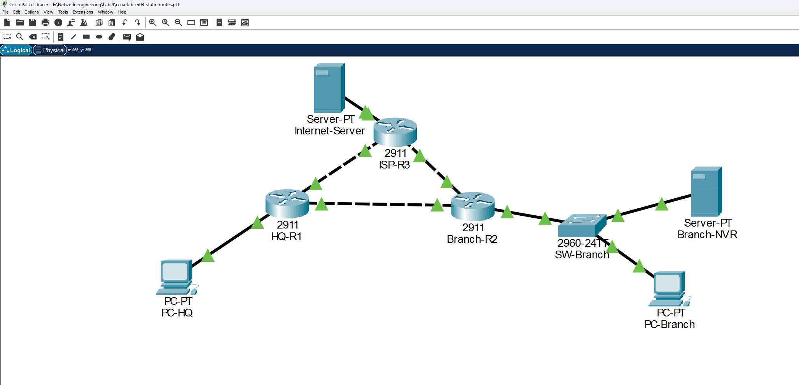

# Branch-Office Static Routing: Standard, Default, Host, and Floating Routes

## Project Summary
Built a three-router branch-office network in Cisco Packet Tracer using only static routing — no dynamic routing protocol anywhere — to connect an HQ site, a branch office, and a simulated ISP transit path. Implemented four distinct static-route types in one design (standard, default, host, and floating) and proved the floating route's automatic failover by shutting down the primary WAN link mid-lab and watching traffic reroute without any reconfiguration.

## Topology
Eight devices, eight links: HQ-R1 and Branch-R2 connected by a primary WAN link, both also linked to a simulated ISP-R3 transit router for Internet access and as a backup path; PC-HQ sits behind HQ-R1, and PC-Branch plus a bandwidth-sensitive video recorder (Branch-NVR) sit behind Branch-R2 through a branch-office switch.

```
PC-HQ --- HQ-R1 --- (primary WAN) --- Branch-R2 --- SW-Branch --- PC-Branch
            |                              |                          |
            +------------ ISP-R3 ---------+                     Branch-NVR
                            |
                      Internet-Server
```



## Objectives
- Configured a standard static route so HQ and the branch office LANs could reach each other
- Configured a default static route on both edge routers pointing at the ISP for all otherwise-unmatched traffic
- Configured a host (/32) static route to steer one bandwidth-heavy server's traffic over a dedicated path, distinct from the rest of its subnet
- Configured a floating static route as an automatic backup for when the primary WAN link fails
- Verified static routing with `show ip route static`, `show running-config`, and an end-to-end ping suite
- Observed longest-prefix-match behavior distinguishing a /32 host route from its parent /24 network route

## Skills Demonstrated
- Standard, default, host (/32), and floating static route configuration on Cisco IOS
- Administrative distance manipulation to build an automatic backup path without a routing protocol
- Longest-prefix-match troubleshooting and verification
- Static-route verification methodology: `show ip route static`, `show ip route <address>`, `show running-config | include ip route`
- Live fault-injection testing of route failover (link shutdown, floating static installation, restoration)

## Build & Verification
HQ-R1 and Branch-R2 were connected by a primary WAN link, with both also independently linked to a simulated ISP router (ISP-R3) for Internet egress. HQ-R1 received a standard static route to Branch's LAN, a default route toward the ISP, and — because Branch's video recorder (Branch-NVR) needed to ride a separate path from the rest of its subnet — a /32 host route pointing that one address at the ISP-transit link instead of the direct WAN link. A floating static route to Branch's whole subnet was layered on top, configured with an administrative distance of 254 so it stays present but unused under normal conditions, only taking over if the direct link's next hop becomes unreachable.

`show ip route static` confirmed all three actively-installed routes on HQ-R1, while the floating route stayed invisible in the table exactly as expected — configured, but losing every AD comparison. A direct query for the NVR's address confirmed the /32 host route, not the broader /24, was the one actually used to reach it. The whole design was proven under failure: shutting down HQ-R1's link to Branch-R2 removed the standard route, the floating static installed automatically in its place, and a ping to Branch's LAN kept succeeding — now routed through the ISP transit path instead. Restoring the link confirmed the standard route reclaimed priority and the floating route receded from view again.

NetForge recorded a passing attempt with **7/7 points** on Mon Aug 17 2026. [Open the full grading record](./evidence/verification/summary.md).

### Lessons Learned
The completed build and verification checks reinforced these outcomes:

- Configure a standard static route so HQ and a branch office can reach each other's LANs
- Configure a default static route pointing an edge router at its ISP
- Configure a host static route to send one specific server's traffic over a different path than its neighbors
- Configure a floating static route as an automatic backup for when the primary WAN link fails
- Verify static routing with show ip route static, show running-config, and end-to-end pings
- Observe longest-prefix-match behavior distinguishing a /32 host route from its parent /24 network route

## Key Configurations
**HQ-R1 — standard route to Branch, default route to the ISP:**
```
HQ-R1(config)#ip route 192.168.20.0 255.255.255.0 10.0.12.2
HQ-R1(config)#ip route 0.0.0.0 0.0.0.0 203.0.113.2
```

**HQ-R1 — host route for one address, riding a different path than the rest of its subnet:**
```
HQ-R1(config)#ip route 192.168.20.50 255.255.255.255 203.0.113.2
```

**HQ-R1 — floating static, configured but dormant until the primary next hop fails:**
```
HQ-R1(config)#ip route 192.168.20.0 255.255.255.0 203.0.113.2 254
```

## Evidence Package

- NetForge recorded this lab as **passed** on Mon Aug 17 2026.
- Automated score: **7/7 points**.
- [Review the automated grading summary](./evidence/verification/summary.md).
- [Verify artifact hashes](./evidence/manifest.md).

| Artifact | What it proves |
|---|---|
| [ccna-lab-m04-static-routes.pkt](./evidence/attachments/ccna-lab-m04-static-routes.pkt) | Reproducible Packet Tracer source |
| [scrn1.png](./evidence/screenshots/scrn1.png) | Learner-captured visual proof |
| [scrn2.png](./evidence/screenshots/scrn2.png) | Learner-captured visual proof |
| [01-pc-static-hq-route-table.txt](./evidence/verification/01-pc-static-hq-route-table.txt) | Captured verification output |
| [02-pc-static-hq-host-route-detail.txt](./evidence/verification/02-pc-static-hq-host-route-detail.txt) | Captured verification output |
| [03-pc-static-hq-floating-configured.txt](./evidence/verification/03-pc-static-hq-floating-configured.txt) | Captured verification output |
| [04-pc-static-branch-r2-routes.txt](./evidence/verification/04-pc-static-branch-r2-routes.txt) | Captured verification output |
| [05-pc-static-ping-nvr.txt](./evidence/verification/05-pc-static-ping-nvr.txt) | Captured verification output |
| [06-pc-static-ping-internet-server.txt](./evidence/verification/06-pc-static-ping-internet-server.txt) | Captured verification output |
| [07-pc-static-floating-installed-after-break.txt](./evidence/verification/07-pc-static-floating-installed-after-break.txt) | Captured verification output |
| [summary.md](./evidence/verification/summary.md) | Automated grading report |

### Evidence Integrity

Automated outputs come from the saved NetForge grading record. Screenshots and optional source files are learner-attached artifacts reviewed before public publication. Expected output is never presented as observed output.

